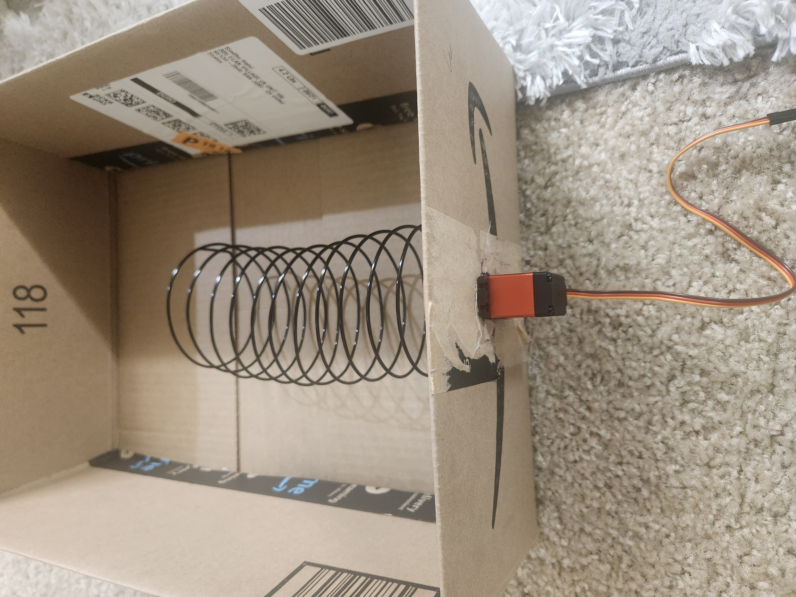
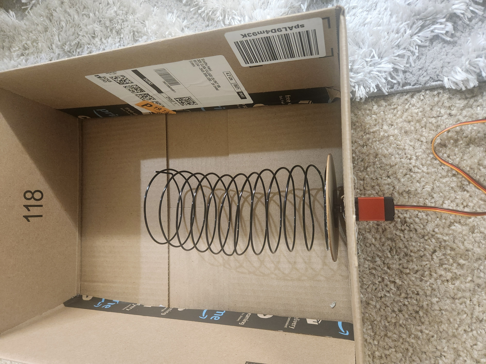
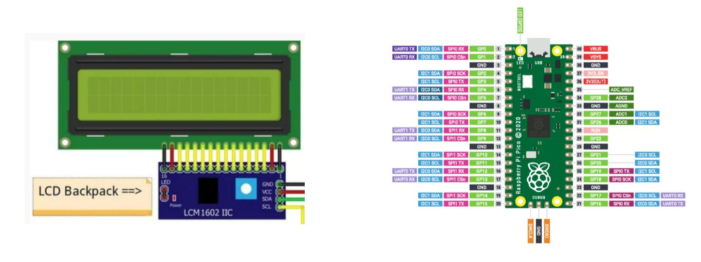
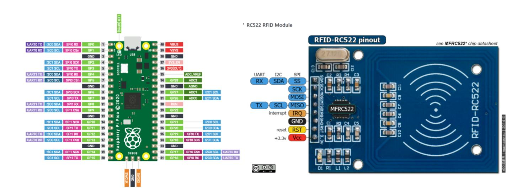
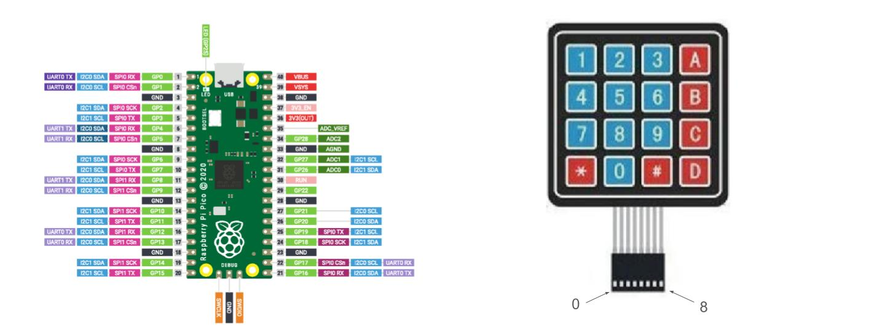
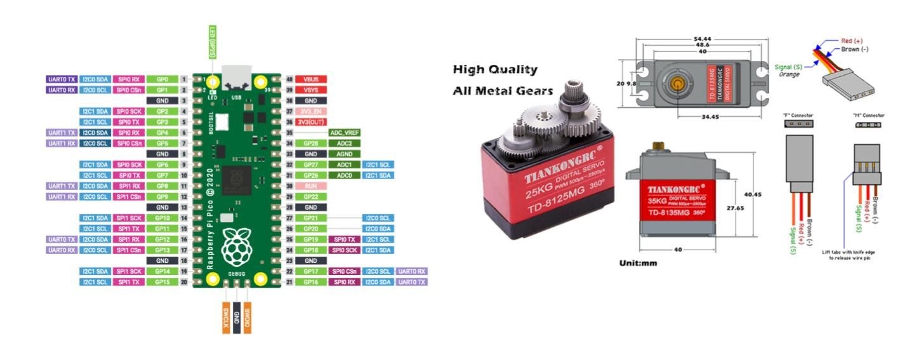

# project-vendigo

## Raspberry Pi Pico W Pin Connections for LCD, RFID, 4x4 Matrix Keypad, and Servo Motors

This README describes the pin configuration of the Raspberry Pi Pico W and its connections to various peripherals like a 16x2 LCD display, RFID-RC522 module, 4x4 Matrix Keypad, and continuous rotation servo motors.

## Working model (Rudimentary)

## Table of Connections

| **Peripheral**     | **Raspberry Pi Pico Pin** | **GPIO Pin Name** | **Peripheral Pin**                | **Description**                                |
|--------------------|---------------------------|-------------------|-----------------------------------|------------------------------------------------|
| **16x2 LCD**       | Pin 38                    | GND               | GND                              | Ground connection for LCD                      |
|                    | Pin 40                    | VBUS              | VCC                              | Power (VCC) connection for LCD                 |
|                    | Pin 9                     | GP6               | SDA                              | Serial Data Line for LCD (I2C interface)       |
|                    | Pin 10                    | GP7               | SCL                              | Serial Clock Line for LCD (I2C interface)      |
| **RFID-RC522**     | Pin 2                     | GP1               | SDA                              | Serial Data Line for RFID (SPI0 CSn)           |
|                    | Pin 4                     | GP2               | SCK                              | Serial Clock for RFID (SPI0 SCK)               |
|                    | Pin 5                     | GP3               | MOSI                             | Master Out Slave In for RFID (SPI0 TX)         |
|                    | Pin 6                     | GP4               | MISO                             | Master In Slave Out for RFID (SPI0 RX)         |
|                    | Pin 3                     | GND               | GND                              | Ground connection for RFID                     |
|                    | Pin 1                     | GP0               | RST                              | Reset pin for RFID                             |
|                    | Pin 36                    | 3V3 OUT           | 3.3V                             | Power connection for RFID                      |
| **4x4 Matrix Keypad** | Pin 11                  | GP8               | Row 1                            | Connection to Row 1 of Keypad                  |
|                    | Pin 12                    | GP9               | Row 2                            | Connection to Row 2 of Keypad                  |
|                    | Pin 14                    | GP10              | Row 3                            | Connection to Row 3 of Keypad                  |
|                    | Pin 15                    | GP11              | Row 4                            | Connection to Row 4 of Keypad                  |
|                    | Pin 16                    | GP12              | Col 1                            | Connection to Column 1 of Keypad               |
|                    | Pin 17                    | GP13              | Col 2                            | Connection to Column 2 of Keypad               |
|                    | Pin 19                    | GP14              | Col 3                            | Connection to Column 3 of Keypad               |
|                    | Pin 20                    | GP15              | Col 4                            | Connection to Column 4 of Keypad               |
| **Continuous Servo**| Pin 28                    | GP28              | Orange wire                      | PWM signal for controlling servo rotation      |
|                    | External Power Supply      | N/A               | Red wire                         | Power (VCC) connection for the servo           |
|                    | Ground (GND)              | N/A               | Brown wire                       | Ground connection for the servo                |

## Schematics

Below are the schematics for the various peripherals connected to the Raspberry Pi Pico W. These diagrams show the pin connections for each component and their corresponding wiring.

### 1. 16x2 LCD Display Schematic

This schematic illustrates the pin connections between the Raspberry Pi Pico W and the 16x2 LCD display, showing how to connect the power, GND, SDA, and SCL pins for proper communication.

### 2. RFID-RC522 Schematic

The RFID-RC522 module uses SPI communication, and this schematic shows the specific GPIO pin assignments for connecting the Raspberry Pi Pico W to the RFID module, including the SDA, SCK, MOSI, and MISO pins.

### 3. 4x4 Matrix Keyboard Schematic

This schematic details how the 4x4 matrix keyboard is wired to the GPIO pins of the Raspberry Pi Pico W. The rows and columns are connected to specific GPIO pins, enabling key presses to be detected.

### 4. Continuous 360° Servo Motor Schematic

This schematic shows the connections for the continuous 360-degree servo motor, including the PWM signal pin (GPIO) on the Raspberry Pi Pico W and the external power supply for the servo.

## Power Supply Notes

- The RFID-RC522 is powered by the 3.3V pin of the Raspberry Pi Pico W.
- The continuous rotation servo motor requires an external power supply. Connect the servo's positive (red) wire to the positive terminal of the external power supply, and the ground (brown) wire to the ground terminal.

## Additional Notes

- The RFID-RC522 module uses SPI communication, which requires configuring the correct pins for SPI0 on the Raspberry Pi Pico W.
- The 16x2 LCD uses the I2C protocol and is connected via the SDA and SCL lines.
- The 4x4 Matrix Keypad is connected to a set of GPIO pins (GP8–GP15) for scanning the row and column inputs.
- Ensure that the servos are properly powered with a separate power supply if needed, as the Raspberry Pi Pico W might not supply enough current to drive multiple motors.

## References

- [Raspberry Pi Pico Documentation](https://datasheets.raspberrypi.com/pico/pico-datasheet.pdf)
- [RFID-RC522 Module Documentation](https://www.nxp.com/docs/en/data-sheet/MFRC522.pdf)
- [4x4 Matrix Keypad Datasheet](https://www.sparkfun.com/datasheets/Components/General/COM-14662_4x4_Matrix_Keypad.pdf)

## Amazon Links

Below are the Amazon links to purchase the components used in this project:

- [360 Degree Continuous Servo Motor](https://www.amazon.com/dp/B08JCT4P3B?ref=ppx_yo2ov_dt_b_fed_asin_title)  
  This servo motor allows continuous rotation and is suitable for applications requiring full 360-degree movement.

- [270 Degree Servo Motor](https://www.amazon.com/dp/B08JCT4P3B?ref=ppx_yo2ov_dt_b_fed_asin_title)  
  This servo motor provides 270 degrees of rotation, suitable for precise angular movements.

- [RFID Reader (MFRC522)](https://www.amazon.com/dp/B07VLDSYRW?ref=ppx_yo2ov_dt_b_fed_asin_title)  
  The RFID reader module used for user authentication and identification.

- [Regulated Power Supply for Servo Motor](https://www.amazon.com/dp/B0CW2HDGCG?ref=ppx_yo2ov_dt_b_fed_asin_title)  
  A regulated power supply to provide stable power for the servo motors.

- [LCD 16x2 Display](https://www.amazon.com/dp/B07S7PJYM6?ref=ppx_yo2ov_dt_b_fed_asin_title)  
  A 16x2 LCD display used to display information like user input or system status.

- [Multicolored Jumper Wires](https://www.amazon.com/dp/B01EV70C78?ref=ppx_yo2ov_dt_b_fed_asin_title)  
  A set of multicolored jumper wires for making quick and reliable connections between components.

- [4x4 Matrix Keyboard](https://www.amazon.com/dp/B08JYNM8D9?ref=ppx_yo2ov_dt_b_fed_asin_title)  
  A 4x4 matrix keyboard used to input product selection numbers or other user commands.

- [Raspberry Pi Pico W](https://www.amazon.com/dp/B0BK9W4H2Q?ref=ppx_yo2ov_dt_b_fed_asin_title)  
  The microcontroller used in this project, capable of running MicroPython and controlling the peripherals.

